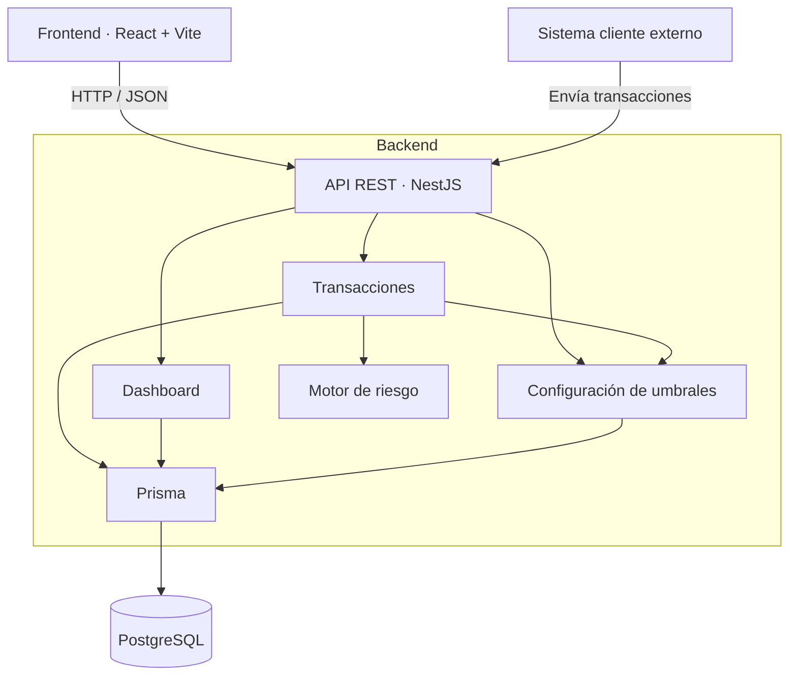

```mermaid
flowchart TD
    A["Frontend · React + Vite"] -->|HTTP / JSON| B["API REST · NestJS"]
    C["Sistema cliente externo"] -->|Envía transacciones| B
    subgraph Backend
        B --> T["Transacciones"]
        B --> D["Dashboard"]
        B --> S["Configuración de umbrales"]
        T --> R["Motor de riesgo"]
        T --> S
        T --> P["Prisma"]
        D --> P
        S --> P
    end
    P --> DB[("PostgreSQL")]
```
