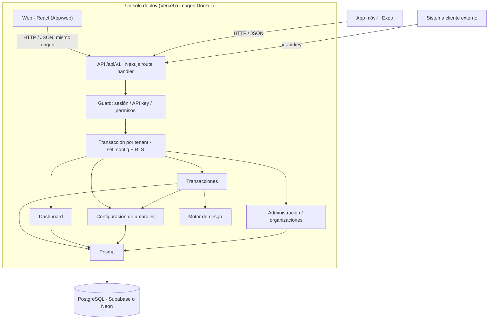

```mermaid
flowchart TD
    W["Web · React (App/web)"] -->|HTTP / JSON, mismo origen| B["API /api/v1 · Next.js route handler"]
    M["App móvil · Expo"] -->|HTTP / JSON| B
    C["Sistema cliente externo"] -->|x-api-key| B
    subgraph Vercel ["Un solo deploy (Vercel o imagen Docker)"]
        W
        B --> G["Guard: sesión / API key / permisos"]
        G --> X["Transacción por tenant · set_config + RLS"]
        X --> T["Transacciones"]
        X --> D["Dashboard"]
        X --> S["Configuración de umbrales"]
        X --> A["Administración / organizaciones"]
        T --> R["Motor de riesgo"]
        T --> S
        T --> P["Prisma"]
        D --> P
        S --> P
        A --> P
    end
    P --> DB[("PostgreSQL · Supabase o Neon")]
```
